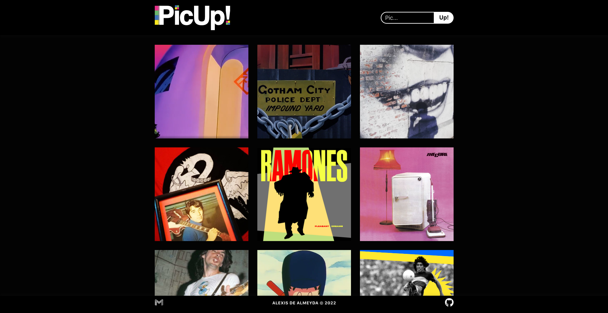
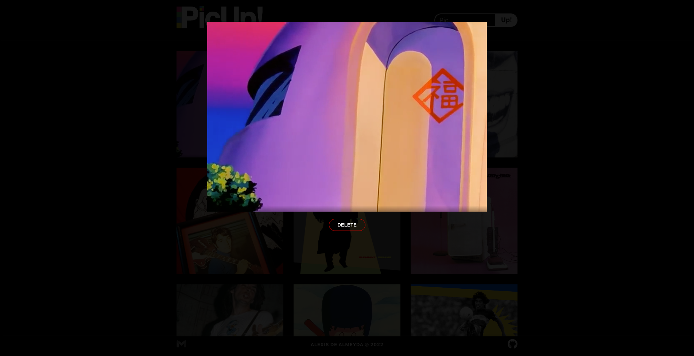

# <div align="center"> PicUp!</div>

## <a href="..." target="_blank">LIVE DEMO</a>

<a href="">

</a>
<a href="">

</a>

## 📄 Descripción:

<p align="center">PicUp! es una app simple, elegante y divertida para subir tus imagenes preferidas a la web...</p>

## 📱 Funcionalidad:

<h3>Carga de imagenes:</h3>
<p align="left">A la derecha del navbar encontrarás un input donde podrás seleccionar las imagen que quieras subir a PicUp!, dandole click a "Pic..." ser abrira una ventana exploradora para que puedas elegir la imagen desde tu dispositivo, luego de seleccionarla deberás hacer click en el botón "Up!" y listo tu primer imagen ya se encontrará cargada en PicUp!</p>

## 🛠️ Tecnologías:

<ul>
  <li><a href="https://reactjs.org/">React JS</a></li>
  <li><a href="https://www.npmjs.com/">NPM</a></li>
  <li><a href="https://nodejs.org/en/">Node JS</a></li>
  <li><a href="https://expressjs.com/">Express</a></li>
  <li><a href="https://www.mysql.com/">MySQL</a></li>
  <li><a href="https://www.adobe.com/la/products/illustrator.html">Adobe Illustrator</a></li>
</ul>

## ⚙️ Requerimientos:

<ul>
  <li><a href="https://git-scm.com/">Git</a></li>
  <li><a href="https://nodejs.org/en/">Node.js</a></li>
  <li><a href="https://www.npmjs.com/">NPM</a></li>
</ul>

## 🚀 Instalación:

```
$ git clone https://github.com/AlexisTercero/crud_images
$ npm install
$ npm start
```

Esta aplicación se abrira en tu navegador en http://localhost:3000
